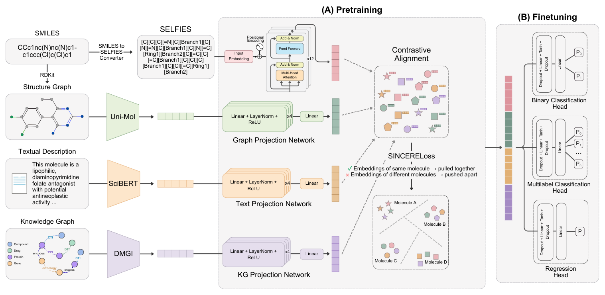

# SELFormerMM: multimodal molecular representation learning via SELFIES, structure, text, and knowledge graph integration

<!-- omit in toc -->

[](http://www.gnu.org/licenses/)

Molecular representation learning is central to computational drug discovery, yet most models still rely on a single modality (e.g. sequences or graphs) and cannot easily unify complementary signals such as text and biological interaction networks. **SELFormerMM** addresses this gap as a unified multimodal framework: it integrates SELFIES encodings, 2D molecular graphs, natural-language descriptions, and knowledge-graph embeddings into a shared latent space, building on the transformer-based [SELFormer](https://iopscience.iop.org/article/10.1088/2632-2153/acdb30). Self-supervised pre-training is carried out on a large-scale multimodal dataset of approximately 3 million molecules.



**Overview of the SELFormerMM framework.** (A) Contrastive multimodal pretraining integrates molecular information from four complementary modalities—SELFIES sequences, structural graphs, textual descriptions, and knowledge graph interactions—processed by modality-specific encoders and projection networks, then aligned in a shared representation space via contrastive learning with the SINCERE loss. (B) Downstream task finetuning adapts the pretrained multimodal backbone for molecular property prediction, using task-specific prediction heads for binary classification, multilabel classification, and regression.

<br/>

## Table of contents

- [The Architecture of SELFormerMM](#the-architecture-of-selformermm)
- [Getting Started](#getting-started)
- [Data pipeline overview](#data-pipeline-overview)
- [Generating SELFIES](#generating-selfies)
- [Generating modality embeddings](#generating-modality-embeddings)
  - [Graph (UniMol)](#graph-unimol)
  - [Text (Hugging Face encoder)](#text-hugging-face-encoder)
  - [KG (DMGI + HeteroData)](#kg-dmgi-heterodata)
- [Producing multimodal embeddings](#producing-multimodal-embeddings)
- [Training and evaluating models](#training-and-evaluating-models)
  - [Pre-training](#pre-training)
  - [Fine-tuning](#fine-tuning)
- [Producing predictions with fine-tuned models](#producing-predictions-with-fine-tuned-models)
- [License](#license)

<br/>

## The Architecture of SELFormerMM
SELFormerMM uses four modality-specific branches and a shared projection space that aligns modalities: the sequence path is [SELFormer]—a RoBERTa-based chemical language model. Text uses frozen [SciBERT](https://github.com/allenai/scibert): mean-pooled 768d embeddings of natural language descriptions. Structure uses frozen [Uni-Mol](https://github.com/deepmodeling/Uni-Mol): 512d cls_repr from SMILES-derived 3D conformers. Knowledge uses a pretrained [DMGI model](https://doi.org/10.1609/aaai.v34i04.5985) on [CROssBARv2-KG](https://github.com/HUBioDataLab/CROssBARv2); relation-specific representations of compound nodes are mean-pooled to 128d per compound. Non-linear MLP projection heads (expansion layers, LayerNorm, ReLU, linear map to hidden size H = 768) map graph, text, and KG embeddings into RoBERTa’s space; zero vectors encode missing modalities. SINCERELoss implements multi-view, multi-positive supervised contrastive alignment (InfoNCE-style) so same-molecule views agree and different molecules separate. 
For downstream evaluation on MoleculeNet, a task-specific head receives the concatenation of the four embeddings (sequence [CLS] plus projected graph, text, and KG).
This repository provides scripts for modality embeddings, pre-training, fine-tuning, and prediction.

<br/>

## Getting Started

We recommend **Conda** (or a fresh venv) with **Python 3.10+**. Install PyTorch for your CUDA/CPU setup, then:

```bash
pip install transformers torch selfies pandas numpy tqdm scikit-learn
# Graph embeddings
pip install rdkit unimol_tools
# Scaffold split (fine-tuning)
pip install chemprop
# KG embeddings (DMGI + PyG)
pip install torch-geometric safetensors
```

Clone or copy the repo and ensure the project root is on `PYTHONPATH`:

```bash
cd /path/to/SELFormerMM
export PYTHONPATH="${PYTHONPATH}:$(pwd)"
```

<br/>

## Data pipeline overview

1. **SELFIES** — From SMILES CSV: `generate_selfies.py`.
2. **Graph embeddings** — Same row order as your molecule table: `generate_graph_embeddings.py` → `graph_embeddings.npy`.
3. **Text embeddings** — Descriptions aligned by row: `generate_text_embeddings.py` → `text_embeddings.npy`.
4. **KG embeddings** — Compound nodes aligned by row with pre-trained DMGI: `generate_kg_embeddings.py` → `kg_embeddings.npy`.
5. **Pre-train** — Pretraining metadata CSV (selfies column) + three `.npy` files (same length): `train_pretraining.py`.
6. **Fine-tune** — One meta CSV (`smiles`, `selfies`, labels) + one NPZ bundling three modalities (graph, text, kg):

**Data and model download.** Pretraining and fine-tuning datasets (including all raw modalities), single-modality embedding files (`graph` / `text` / `kg`), the pretrained SELFormerMM multimodal checkpoint, and fine-tuned task checkpoints are available from the Hugging Face dataset: **[HUBioDataLab/SELFormerMM](https://huggingface.co/datasets/HUBioDataLab/SELFormerMM)**.

<br/>

## Generating SELFIES

```
python3 generate_selfies.py --smiles_dataset=data/input.csv --selfies_dataset=data/output_with_selfies.csv --smiles_column=smiles
```

* __--smiles_dataset__ — Input CSV path.  
* __--selfies_dataset__ — Output CSV (adds column `selfies`).  
* __--smiles_column__ — SMILES column name (default `smiles`).  
* __--on_error__ — `keep` | `empty` | `raise` for encoder errors.

<br/>

## Generating modality embeddings

You can download precomputed embeddings [here](https://huggingface.co/datasets/HUBioDataLab/SELFormerMM/tree/main/pretraining_datasets), or generate embeddings for your own dataset using the following scripts.

### Graph (UniMol)

```
python3 generate_graph_embeddings.py --input_csv=data/pretraining_datasets/pretraining_dataset_meta.csv --output_npy=data/pretraining_datasets/graph_embeddings.npy --smiles_column=smiles --batch_size=512 --embedding_dim=512 --normalize=1
```

Optional: `--output_csv`, `--id_column`, `--gpu_ids=0,1`, `--use_gpu=0` (CPU), `--batch_timeout_seconds`, `--min_batch_size`.

### Text (Hugging Face encoder)

```
python3 generate_text_embeddings.py --input_csv=data/pretraining_datasets/pretraining_dataset_meta.csv --output_npy=data/pretraining_datasets/text_embeddings.npy --text_column=Description --model_name=allenai/scibert_scivocab_uncased --max_length=512 --normalize=1
```

<a id="kg-dmgi-heterodata"></a>

### KG (DMGI + HeteroData)

```
python3 generate_kg_embeddings.py --checkpoint_path=/data/models/DMGI/dmgi_model.pt --heterodata_path=/data/pretraining_datasets/selformermm_kg_heterodata.pt --output_npy=data/pretraining_datasets/kg_embeddings.npy --align_meta_csv=data/pretraining_datasets/pretraining_dataset_meta.csv --align_meta_column=chembl_id --node_type=Compound --out_channels=128 --normalize=1
```

<br/>

## Producing multimodal embeddings

This script loads the pretrained SELFormerMM. Pass the single modality `.npy` files (graph / text / KG), aligned row-wise with the pretraining metadata CSV.

```
python3 produce_multimodal_embeddings.py \
  --selfies_csv=data/pretraining_datasets/pretraining_dataset_meta.csv \
  --selfies_column=selfies \
  --pretrained_multimodal_dir=/data/models/SELFormerMM \
  --graph_embs=data/pretraining_datasets/graph_embeddings.npy \
  --text_embs=data/pretraining_datasets/text_embeddings.npy \
  --kg_embs=data/pretraining_datasets/kg_embeddings.npy \
  --output_npy=data/multimodal_embeddings.npy \
  --output_mode=concat \
  --batch_size=32 \
  --max_len=512
```

* __--output_mode__ — `concat`: `(N, 4*D)`; `stacked`: `(4N, D)`.  
* __--output_csv__ / __--id_column__ — Optional CSV with ID + embedding columns.

<br/>

## Training and evaluating models

### Pre-training
Generate the SELFIES CSV and single modality embeddings, or download ready-to-use files from [here](https://huggingface.co/datasets/HUBioDataLab/SELFormerMM/tree/main/pretraining_datasets), then train the SELFormerMM multimodal backbone using the following script.

```
python3 train_pretraining.py \
  --selfies_csv=data/pretraining_datasets/pretraining_dataset_meta.csv \
  --selfies_column=selfies \
  --graph_embs=data/pretraining_datasets/graph_embeddings.npy \
  --text_embs=data/pretraining_datasets/text_embeddings.npy \
  --kg_embs=data/pretraining_datasets/kg_embeddings.npy \
  --model_path=HUBioDataLab/SELFormer \
  --tokenizer_path=HUBioDataLab/SELFormer \
  --save_dir=/data/models/SELFormerMM \
  --batch_size=40 \
  --max_len=512 \
  --epochs=267 \
  --lr=2e-5 \
  --val_frac=0.1 \
  --save_every=1 \
  --save_embeddings=data/final_pretrain_embeddings.npy
```

* __--selfies_csv__ — CSV with SELFIES column (required).  
* __--graph_embs__ / __--text_embs__ / __--kg_embs__ — Optional `.npy`; omitted modalities are zero-filled.  
* __--model_path__ — HF model id/local directory of unimodal SELFormer.
* __--tokenizer_path__ — HF tokenizer id/local directory of unimodal SELFormer.
* __--save_dir__ — Checkpoints under `epoch_XXX/` plus final `pytorch_model.bin` + config + tokenizer.
* __--save_embeddings__ — Optional memmap `.npy` for all rows after training.

<br/>

### Fine-tuning

Use the pretrained SELFormerMM multimodal backbone to fine-tune on your own dataset using the following script. Inputs are a task CSV (`<task>.csv`) with `selfies`, `smiles`, and label column(s) and (`<task>_embs.npz`) file that contains the single modality embeddings. Ready-to-use datasets can be found [here](https://huggingface.co/datasets/HUBioDataLab/SELFormerMM/tree/main/finetuning_datasets).

**Binary classification example:**
```
python3 train_finetuning.py \
  --dataset_meta_csv=data/finetuning_datasets/classification/bbbp/bbbp.csv \
  --dataset_embs_npz=data/finetuning_datasets/classification/bbbp/bbbp_embs.npz \
  --model_path=HUBioDataLab/SELFormer \
  --tokenizer_path=HUBioDataLab/SELFormer \
  --pretrained_multimodal_dir=/data/models/SELFormerMM \
  --task_type=binary \
  --use_scaffold=1 \
  --batch_size=8 \
  --max_len=128 \
  --epochs=50 \
  --backbone_lr=1e-5 \
  --head_lr=1e-4 \
  --weight_decay=0.1 \
  --checkpoint_every=25 \
  --save_dir=/data/models/finetuned_models/classification/bbbp
```

**Multi-label example:**
```
python3 train_finetuning.py \
  --dataset_meta_csv=data/finetuning_datasets/classification/sider/sider.csv \
  --dataset_embs_npz=data/finetuning_datasets/multilabel/sider/sider_embs.npz \
  --model_path=HUBioDataLab/SELFormer \
  --tokenizer_path=HUBioDataLab/SELFormer \
  --pretrained_multimodal_dir=/data/models/SELFormerMM \
  --task_type=multilabel \
  --use_scaffold=1 \
  --batch_size=8 \
  --max_len=128 \
  --epochs=50 \
  --backbone_lr=1e-5 \
  --head_lr=1e-4 \
  --weight_decay=0.1 \
  --checkpoint_every=25 \
  --save_dir=/data/models/finetuned_models/classification/sider
```
**Regression example:**
```
python3 train_finetuning.py \
  --dataset_meta_csv=data/finetuning_datasets/regression/freesolv/freesolv.csv \
  --dataset_embs_npz=data/finetuning_datasets/regression/freesolv/freesolv_embs.npz \
  --model_path=HUBioDataLab/SELFormer \
  --tokenizer_path=HUBioDataLab/SELFormer \
  --pretrained_multimodal_dir=/data/models/SELFormerMM \
  --task_type=regression \
  --use_scaffold=1 \
  --batch_size=8 \
  --max_len=128 \
  --epochs=50 \
  --backbone_lr=1e-5 \
  --head_lr=1e-4 \
  --weight_decay=0.1 \
  --checkpoint_every=25 \
  --save_dir=/data/models/finetuned_models/regression/freesolv
```

Useful flags: `--config=finetune.json` (inject defaults), `--save_split_csvs=dir`, `--train_frac` / `--val_frac` / `--test_frac`, `--test_eval_every`, `--device=cuda`.

<br/>

## Producing predictions with fine-tuned models

This script loads the fine-tuned SELFormerMM multimodal backbone and produces predictions on a new dataset using the following script. Inputs are a task CSV (`<task>.csv`) with `selfies`, `smiles`, and label column(s) and (`<task>_embs.npz`) file that contains the single modality embeddings. Ready-to-use datasets and our finetuned models can be found [here](https://huggingface.co/datasets/HUBioDataLab/SELFormerMM/tree/main/models/finetuned).

**Binary classification example:**
```
python3 predict.py \
  --model_dir=/data/models/finetuned_models/classification/bbbp \
  --input_meta_csv=data/finetuning_datasets/classification/bbbp/bbbp.csv \
  --input_embs_npz=data/finetuning_datasets/classification/bbbp/bbbp_embs.npz \
  --output_csv=data/finetuning_datasets/classification/bbbp/bbbp_predictions.csv \
  --task_type=binary \
  --num_labels=2 \
  --batch_size=16 \
  --max_len=512 \
  --output_id_column=smiles
```

**Multi-label example:**
```
python3 predict.py \
  --model_dir=/data/models/finetuned_models/multilabel/sider \
  --input_meta_csv=data/finetuning_datasets/multilabel/sider/sider.csv \
  --input_embs_npz=data/finetuning_datasets/multilabel/sider/sider_embs.npz \
  --output_csv=data/finetuning_datasets/multilabel/sider/sider_predictions.csv \
  --task_type=multilabel \
  --batch_size=16 \
  --max_len=512 \
  --output_id_column=smiles
```

**Regression example:**
```
python3 predict.py \
  --model_dir=/data/models/finetuned_models/regression/freesolv \
  --input_meta_csv=data/finetuning_datasets/regression/freesolv/freesolv.csv \
  --input_embs_npz=data/finetuning_datasets/regression/freesolv/freesolv_embs.npz \
  --output_csv=data/finetuning_datasets/regression/freesolv/freesolv_predictions.csv \
  --task_type=regression \
  --num_labels=1 \
  --batch_size=16 \
  --max_len=512 \
  --output_id_column=smiles
```

<br/>

## License

Copyright (C) 2026 HUBioDataLab

This program is free software: you can redistribute it and/or modify it under the terms of the GNU General Public License as published by the Free Software Foundation, either version 3 of the License, or (at your option) any later version.

This program is distributed in the hope that it will be useful, but WITHOUT ANY WARRANTY; without even the implied warranty of MERCHANTABILITY or FITNESS FOR A PARTICULAR PURPOSE. See the GNU General Public License for more details.

You should have received a copy of the GNU General Public License along with this program. If not, see http://www.gnu.org/licenses/.